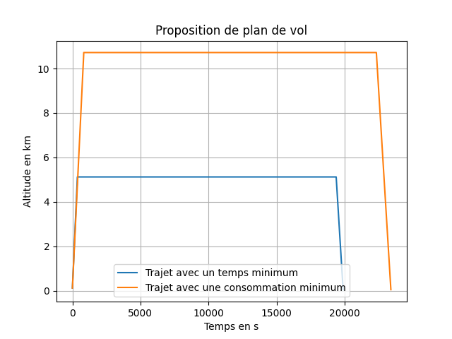
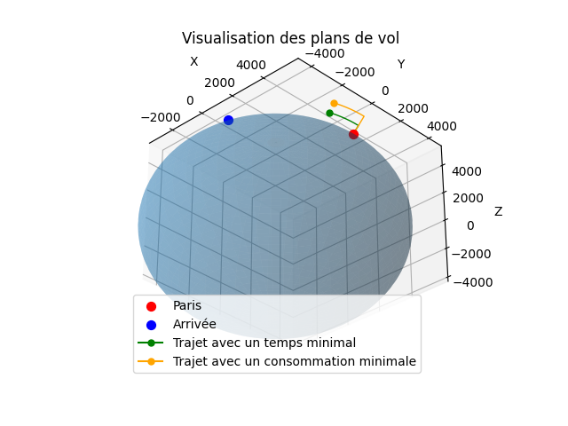

==================
Exemple d'utilisation
==================

Nous allons vous présenter ici un exemple d'utilisation.

Tout d'abord, l'utilisateur est invité à choisir un avion parmi la base de données suivantes

*Choix avion*
-------------
.. csv-table::
   :file: data/Base_donnee_avions.csv
   :delim: ;

*Choix aéroport de destination*
-------------
.. csv-table::
   :file: data/Base_donnee_aeroports.csv
   :delim: ;

*Résultats du programme*
-------------
Considérons un vol sur Boeing 777 pour un vol CDG-YUL,
Nous obtenons dès lors :

- Distance aéroports : 5541,12 Km
- H_t_min :  5,04 Km (Altitude pour un temps de vol minimal)
- H_c_min : 10.64 km (Altitude pour une consommation minimale)
- Temps de trajet minimal : 5.52 h
- Temps de trajet pour une consommation minimale : 6.5 h
- Pour le vol avec une consommation minimale,  121.766 tonnes de carburant ont été consommé
- Pour le trajet le plus rapide, 123.61 tonnes de carburant ont été consommé

Nous obtenons aussi les courbes suivantes:

